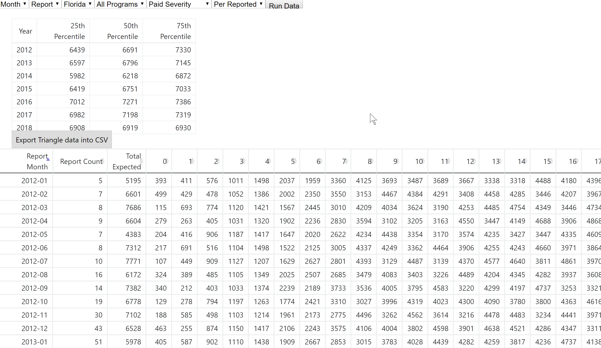
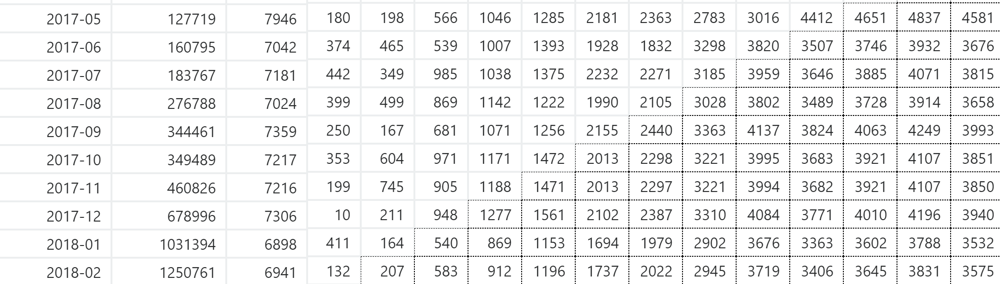

# Severity Triangles

[Link](https://htmlpreview.github.io/?https://github.com/jjburke3/severity_triangle/blob/master/severity_tri.html)

This report was requested by actuaries at my prior company, and pulled directly through data that was updated daily through a php connection.

The main thing that it does is show the severity triangle that you can get from just displaying paid amounts my the loss report month and lag period on a claim payment

The reason this is a created report instead of just displaying this data in an excel spreadsheet is to allow for expected values for more current months that have not have time to fully develop (we used 72 months for this time period).  They are displayed as the cells with a dashed border.  This calculation requires arrays which may or may not be updated over time, and would have been difficlut to implement in a simple spreadsheet

## Built With

* [d3.js](https://d3js.org/) - Javascript Library for Manipulating Data
* [Bootstrap](https://getbootstrap.com/) - Frontend Webframe Work
* [jQuery](https://jquery.com/) - Javascript Library for simiplfying javascript commands
* [tablesorter](http://tablesorter.com/docs/) - jQuery pluggin for table formatting

